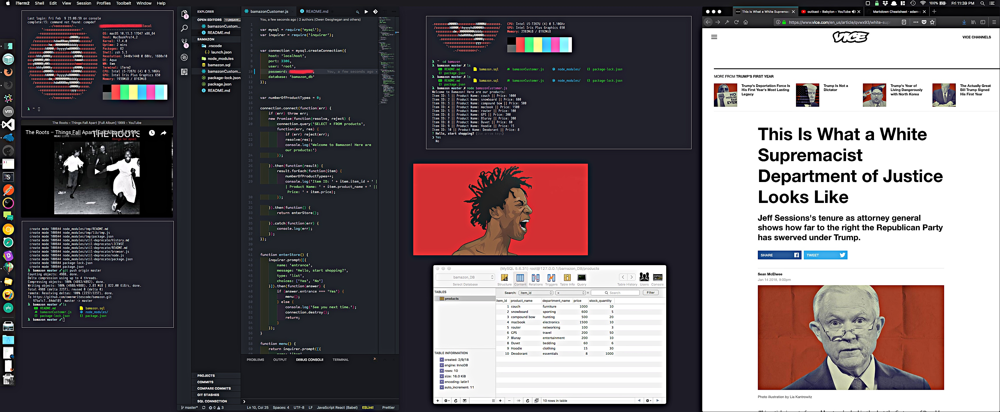
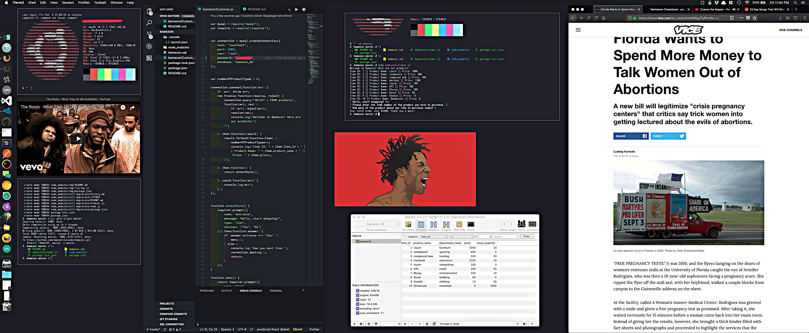
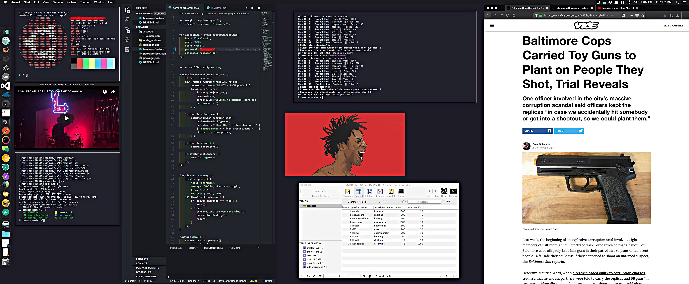

# Bamazon - Node.Js & MySQL - Week 12
Week 12 Homework - Owen Geoghegan

## Setup & ScreenShots
To setup, clone repo & navigate to directory in terminal.

1.Run: `npm i` in terminal.
2.Navigate to: bamazonCustomer.js - scroll several lines down until the "password: '' " line is found.  Enter your sql password in this field.
3.Run: `bamazon.sql` in SQL client.
4.Run: `node bamazonCustomer.js` in terminal.

Addl information:
>Port :3306
> If prompted for credentials, enter them!

## ScreenShots
> See terminal in top center of screen for Node.Js app.

###Step One

###Step Two

###Step Three (Second Example)

